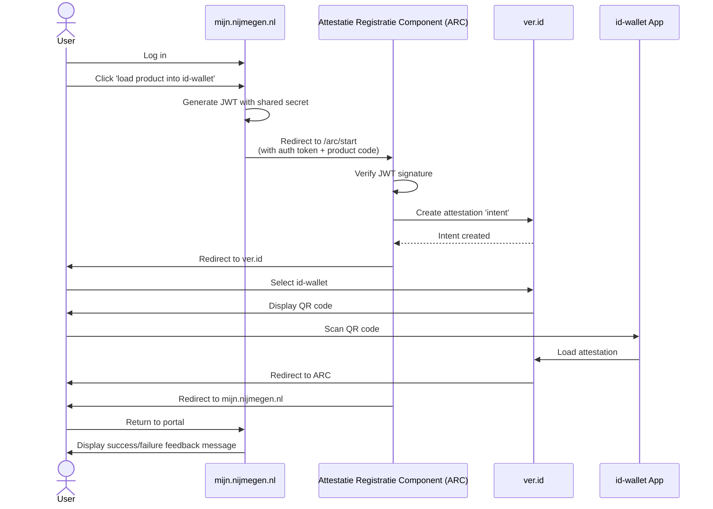

# Attestatie Registratie Component

A component to map products from [Open Product](https://github.com/maykinmedia/open-product) as attestaties into id-wallet, using [ver.id](https://ver.id/) as the id-wallet service provider.

## Goal

**Primary:** Demonstrate how a municipality can integrate id-wallet attestation.  
**Secondary:** Provide an installable package integrating Open Product and ver.id to load a product in an id-wallet.

## Background

Developed by gemeente Nijmegen in collaboration with ver.id and Maykin (Open Product) and [Woweb](https://www.woweb.nl/). Created at the Common Ground Field Labs (January 2024, Utrecht), organized by VNG Realisatie B.V.

**Use case:** Citizens on mijn.nijmegen.nl can view their products (e.g., alcohol sales license for vierdaagsefeesten), load them into their id-wallet, and handhavers can scan the attestation for verification.

## Current state

This project is in active development and is definitly not production ready. If you'd like to collaborate or talk about this project, you can find us at the next Common Ground Fieldlab.

## Configuration

- The `VER_ID_GH_TOKEN` environment variable is required as long as the ver.id SDK npm package is not publicly released.
- `JWT_SECRET`: Secret key used to verify the JWT token sent by the portal.

To be added:
- Authentication token for the open product API
- Configuration to map open products to attestations

## User Flow

To be added:
- ARC should retrieve the product data from open product
- ARC should validate the user ownership of the license.

## Technical

Can be deployed as:
- Docker image with npm package
- Standalone npm package
- npm package on AWS Lambda (current implementation)
