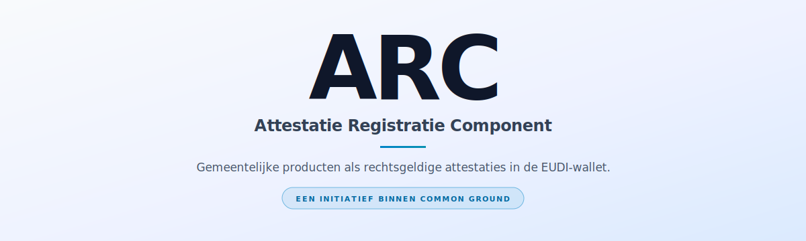
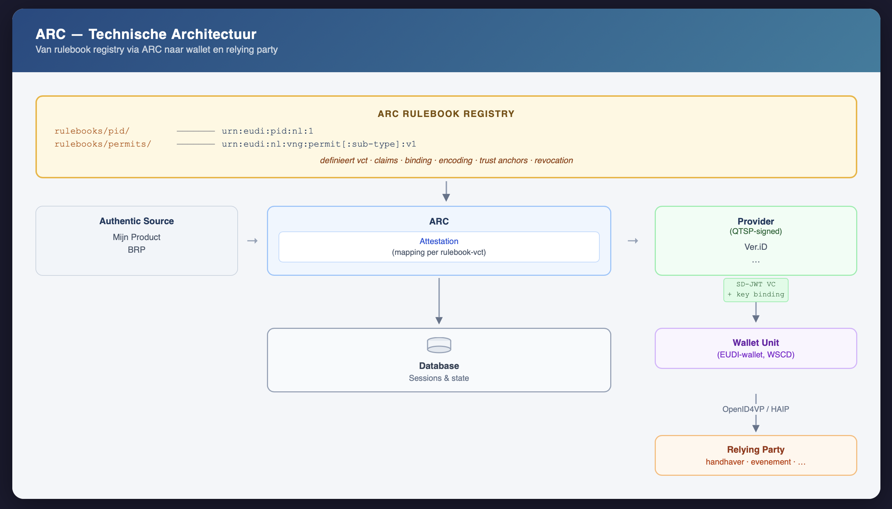

  <picture>
    <source media="(prefers-color-scheme: dark)" srcset="docs/hero-dark.svg">
    <source media="(prefers-color-scheme: light)" srcset="docs/hero-light.svg">
    
  </picture>

> [!WARNING]
> **In ontwikkeling** · ARC en de rulebooks in deze repository zijn pre-release. De rulebooks hebben de status *Draft*, en API's, configuratie en gedrag kunnen tussen releases wijzigen. Nog niet inzetten voor productie zonder afstemming met de auteurs.

# Attestatie Registratie Component (ARC)

**Gedeelde registry van Attestation Rulebooks voor rechtsgeldige PuB-EAAs van Nederlandse gemeenten, met een herbruikbare implementatie die deze rulebooks uitgeeft. Een initiatief van [Gemeente Nijmegen](https://www.nijmegen.nl/) in samenwerking met [Ver.iD](https://ver.id/) binnen [Common Ground](https://commonground.nl).**

## Wat is ARC?

ARC is de gedeelde plek waar Nederlandse gemeenten definiëren hoe hun producten als rechtsgeldige attestaties in een EUDI-wallet worden uitgegeven en geverifieerd. De definities zelf staan in [rulebooks/](rulebooks/); de TypeScript-library in [src/](src/) implementeert ze. Eén bron van waarheid, één set afspraken, één manier om ze na te leven.

Het initiatief loopt binnen [Common Ground](https://commonground.nl), de informatiekundige beweging waarin Nederlandse gemeenten onder regie van [VNG Realisatie](https://vng.nl/projecten/programma-common-ground) samenwerken aan gemeenschappelijke, herbruikbare oplossingen voor hun informatievoorziening. Andere overheden kunnen op termijn aansluiten met eigen rulebooks.

## Waarom ARC?

Onder de [eIDAS 2.0-verordening (EU) 2024/1183](https://eur-lex.europa.eu/legal-content/EN/TXT/HTML/?uri=OJ:L_202401183) is een **PuB-EAA** een juridische categorie met **dezelfde rechtskracht als een papieren attestatie** (art. 45f, Annex VII). Het betreft een elektronische attestatie uitgegeven door of namens een publiekrechtelijke instantie die verantwoordelijk is voor een authentieke bron. Die status volgt alleen wanneer de attestatie aantoonbaar voldoet aan de eisen die Annex VII van de verordening en Topic 12 van het [EUDI Architecture and Reference Framework](https://github.com/eu-digital-identity-wallet/eudi-doc-architecture-and-reference-framework) (ARB_01 t/m ARB_34) stellen.

ARC borgt dat deze community één gedeelde, gereviewde set rulebooks heeft die aantoonbaar in lijn is met die eisen, plus een referentie-implementatie die ze 1-op-1 uitgeeft. Daarmee is voor uitgevende instanties, Relying Parties en burgers helder waar een credential op staat en wat het waard is.

## Rechtsgeldigheid

Rechtsgeldigheid is de bestaansreden van ARC: zonder dat een credential aantoonbaar voldoet aan de eisen die eIDAS 2.0 en het ARF stellen, heeft het geen juridische status. Het volledige stelsel van bronnen, rollen, technische eisen en vertrouwensinfrastructuur waarop de rechtsgevolgen van een PuB-EAA berusten, staat in [docs/rechtsgeldigheid.md](docs/rechtsgeldigheid.md).

## Architectuur op hoofdlijnen

De technische uitwerking van de vier lagen (`Source`, `Attestation`, `Provider`, `Store`) staat in [docs/architectuur.md](docs/architectuur.md). De koppeling aan uw eigen applicatie staat in [docs/integratie.md](docs/integratie.md).

## Bijdragen aan het scheme

Een nieuw type credential rechtsgeldig uitgeven onder dit scheme is **twee taken**, op te leveren als één geheel:

1. **Een rulebook schrijven**: de juridisch-technische definitie van de attestatie. Zie [docs/adding-a-rulebook.md](docs/adding-a-rulebook.md) voor de structuur, verplichte velden en de compliance-matrix die afgesloten moet zijn voordat een rulebook in het scheme wordt opgenomen.
2. **De mapping implementeren**: een `Attestation` die brondata 1-op-1 vertaalt naar de claims uit de rulebook. Zie [docs/adding-an-attestation.md](docs/adding-an-attestation.md).

Beide stappen landen in dezelfde pull request, zodat de rulebook en de implementatie samen worden gereviewd.

## Docker voorbeeld

Voor een werkend voorbeeld van hoe ARC kan worden ingezet als een standalone HTTP server (bijv. in een container-omgeving), zie de [docker](./docker) directory.

Dit voorbeeld bevat een complete setup met een Express API en PostgreSQL database om ARC snel lokaal uit te proberen.

## Documentatie

| Onderwerp                                   | Document                                                       |
|---------------------------------------------|----------------------------------------------------------------|
| Rechtsgeldigheid onder eIDAS 2.0 en het ARF | [docs/rechtsgeldigheid.md](docs/rechtsgeldigheid.md)           |
| Architectuur en kernabstracties             | [docs/architectuur.md](docs/architectuur.md)                   |
| ARC integreren in uw applicatie             | [docs/integratie.md](docs/integratie.md)                       |
| Een rulebook schrijven                      | [docs/adding-a-rulebook.md](docs/adding-a-rulebook.md)         |
| Een attestatie toevoegen (mapping)          | [docs/adding-an-attestation.md](docs/adding-an-attestation.md) |
| Een provider toevoegen                      | [docs/adding-a-provider.md](docs/adding-a-provider.md)         |
| Een bron toevoegen                          | [docs/adding-a-source.md](docs/adding-a-source.md)             |
| Bestaande rulebooks                         | [rulebooks/](rulebooks/)                                       |

## Status

ARC is in actieve ontwikkeling. De rulebooks in deze repository hebben de status *Draft* en worden iteratief afgestemd met deelnemers uit de Common Ground Field Labs. Feedback en bijdragen zijn welkom via [issues](https://github.com/GemeenteNijmegen/attestatie-registratie-component/issues) en pull requests.

## Achtergrond

Ontwikkeld door [Gemeente Nijmegen](https://www.nijmegen.nl/) in samenwerking met [Ver.iD](https://ver.id/). Ontstaan op de Common Ground Field Labs, georganiseerd door [VNG Realisatie](https://vng.nl/artikelen/common-ground).

## Licentie

[EUPL-1.2](LICENSE)
