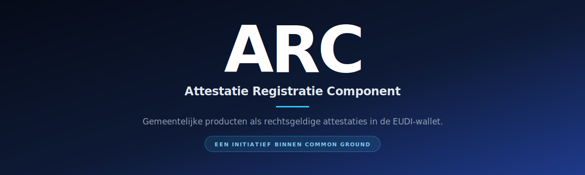

<p align="center">
  
</p>

# Attestatie Registratie Component (ARC)

**Gedeelde registry van Attestation Rulebooks voor rechtsgeldige PuB-EAAs van Nederlandse gemeenten, met een herbruikbare implementatie die deze rulebooks uitgeeft. Een initiatief van [Gemeente Nijmegen](https://www.nijmegen.nl/), [Ver.ID](https://ver.id/) en [Maykin Media](https://www.maykinmedia.nl/) binnen [Common Ground](https://commonground.nl).**

## Wat is ARC?

ARC is de gedeelde plek waar Nederlandse gemeenten definiëren hoe hun producten als rechtsgeldige attestaties in een EUDI-wallet worden uitgegeven en geverifieerd. De definities zelf staan in [rulebooks/](rulebooks/); de TypeScript-library in [src/](src/) implementeert ze. Eén bron van waarheid, één set afspraken, één manier om ze na te leven.

Het initiatief loopt binnen [Common Ground](https://commonground.nl), de informatiekundige beweging waarin Nederlandse gemeenten onder regie van [VNG Realisatie](https://vng.nl/projecten/programma-common-ground) samenwerken aan gemeenschappelijke, herbruikbare oplossingen voor hun informatievoorziening. Andere overheden kunnen op termijn aansluiten met eigen rulebooks.

## Waarom ARC?

Onder de [eIDAS 2.0-verordening (EU) 2024/1183](https://eur-lex.europa.eu/legal-content/EN/TXT/HTML/?uri=OJ:L_202401183) is een **PuB-EAA** een juridische categorie met **dezelfde rechtskracht als een papieren attestatie** (art. 45f, Annex VII). Het betreft een elektronische attestatie uitgegeven door of namens een publiekrechtelijke instantie die verantwoordelijk is voor een authentieke bron. Die status volgt alleen wanneer de attestatie aantoonbaar voldoet aan de eisen die Annex VII van de verordening en Topic 12 van het [EUDI Architecture and Reference Framework](https://github.com/eu-digital-identity-wallet/eudi-doc-architecture-and-reference-framework) (ARB_01 t/m ARB_34) stellen.

ARC borgt dat deze community één gedeelde, gereviewde set rulebooks heeft die aantoonbaar in lijn is met die eisen, plus een referentie-implementatie die ze 1-op-1 uitgeeft. Daarmee is voor uitgevende instanties, Relying Parties en burgers helder waar een credential op staat en wat het waard is.

## Rechtsgeldigheid

Onder artikel 45f van [eIDAS 2.0](https://eur-lex.europa.eu/legal-content/EN/TXT/HTML/?uri=OJ:L_202401183) heeft een PuB-EAA dezelfde rechtsgevolgen als een papieren attestatie. Die status berust op een samenhangend stelsel dat het [ARF](https://github.com/eu-digital-identity-wallet/eudi-doc-architecture-and-reference-framework) technisch uitwerkt:

- **Authentieke bron** (§3.10): een bij wet erkende registratie zoals BRP, KvK, RDW, Kadaster of een gemeentelijke productregistratie. Zonder authentieke bron geen PuB-EAA.
- **Attestation Provider** (§3.7): publiekrechtelijke instantie of haar gemachtigde, ondertekent met een door een QTSP afgegeven gekwalificeerd certificaat, geregistreerd bij een nationale Registrar (§3.17) en onder toezicht van Supervisory Bodies (§3.13).
- **Compliance- en trust-framework**: Annex VII (data-elementen) en Topic 12 van het ARF (ARB_01 t/m ARB_34) als technische vertaling; vertrouwen verankerd via de [LOTL](https://digital-strategy.ec.europa.eu/en/policies/eu-trusted-lists) met QTSP-trust anchors, Wallet Provider-LoTEs en Provider-registraties per lidstaat.
- **Rulebook**: legt voor één attestatietype vast welk formaat (SD-JWT VC), `vct`, claims, trust anchors, revocation-mechanisme en presentatieprotocol gelden, met een sluitende compliance-matrix tegen Annex VII en Topic 12. Niet conform = geen PuB-EAA.

Twee processen dragen het kader in de praktijk:

- **Uitgifte** (§6.6.2): keten van vertrouwensrelaties tussen wallet, Provider en Wallet Provider (Trusted Lists, gebruikersauthenticatie, Wallet Instance en Wallet Unit Attestations); de Provider bezegelt met het gekwalificeerd zegel. De binding aan de rechthebbende uit de authentieke bron wordt per type in de rulebook gespecificeerd.
- **Verificatie** (§6.6.3): verplicht is het gekwalificeerd zegel + certificate-chain tegen de QTSP Trusted List. Aanvullend, afhankelijk van rulebook en gebruikssituatie: revocation-status, device binding (`cnf` bij SD-JWT VC), cross-credential binding, administratieve geldigheid en User binding.

Procedures per attestatietype staan in Hoofdstuk 2 (uitgifte) en Hoofdstuk 5 (verificatie) van de rulebook.

## Architectuur op hoofdlijnen

```text
   ┌─────────────────────────────────────────────────────────────────────────────┐
   │                         ARC RULEBOOK REGISTRY                               │
   │                                                                             │
   │   rulebooks/pid/        ───────  urn:eudi:pid:nl:1                          │
   │   rulebooks/permits/    ───────  urn:eudi:nl:vng:permit[:sub-type]:v1       │
   │                                                                             │
   └─────────────────────────────────────┬───────────────────────────────────────┘
                                         │ definieert vct, claims, binding,
                                         │ encoding, trust anchors, revocation
                                         ▼
   ┌──────────────┐   ┌──────────────┐   ┌─────────────────────────────┐   ┌──────────────────┐
   │  Authentic   │   │   Source     │   │            ARC              │   │     Provider     │
   │   Source     │──▶│   adapter    │──▶│   ┌────────────────────┐    │──▶│  (QTSP-signed)   │
   │              │   │              │   │   │   Attestation      │    │   │                  │
   │ Mijn Product │   │ OpenProduct  │   │   │   (mapping per     │    │   │      Ver.iD      │
   │     BRP      │   │     …        │   │   │    rulebook-vct)   │    │   │       …          │
   │     KvK      │   │              │   │   └────────────────────┘    │   │                  │
   │     RDW      │   │              │   │   ┌────────────────────┐    │   └────────┬─────────┘
   │   Kadaster   │   │              │   │   │ Store (sessions)   │    │            │ SD-JWT VC
   └──────────────┘   └──────────────┘   │   └────────────────────┘    │            │ + key binding
                                         └─────────────────────────────┘            ▼
                                                              ┌────────────────────────────────┐
                                                              │          Wallet Unit           │
                                                              │       (EUDI-wallet, WSCD)      │
                                                              └────────────────┬───────────────┘
                                                                               │  OpenID4VP / HAIP
                                                                               ▼
                                                              ┌────────────────────────────────┐
                                                              │         Relying Party          │
                                                              │   handhaver · evenement · …    │
                                                              └────────────────────────────────┘
```

De technische uitwerking van de vier lagen (`Source`, `Attestation`, `Provider`, `Store`) staat in [docs/architectuur.md](docs/architectuur.md). De koppeling aan uw eigen applicatie staat in [docs/integratie.md](docs/integratie.md).

## Bijdragen aan het scheme

Een nieuw type credential rechtsgeldig uitgeven onder dit scheme is **twee taken**, op te leveren als één geheel:

1. **Een rulebook schrijven**: de juridisch-technische definitie van de attestatie. Zie [docs/adding-a-rulebook.md](docs/adding-a-rulebook.md) voor de structuur, verplichte velden en de compliance-matrix die afgesloten moet zijn voordat een rulebook in het scheme wordt opgenomen.
2. **De mapping implementeren**: een `Attestation` die brondata 1-op-1 vertaalt naar de claims uit de rulebook. Zie [docs/adding-an-attestation.md](docs/adding-an-attestation.md).

Beide stappen landen in dezelfde pull request, zodat de rulebook en de implementatie samen worden gereviewd.

## Documentatie

| Onderwerp | Document |
| --- | --- |
| Architectuur en kernabstracties | [docs/architectuur.md](docs/architectuur.md) |
| ARC integreren in uw applicatie | [docs/integratie.md](docs/integratie.md) |
| Een rulebook schrijven | [docs/adding-a-rulebook.md](docs/adding-a-rulebook.md) |
| Een attestatie toevoegen (mapping) | [docs/adding-an-attestation.md](docs/adding-an-attestation.md) |
| Een provider toevoegen | [docs/adding-a-provider.md](docs/adding-a-provider.md) |
| Een bron toevoegen | [docs/adding-a-source.md](docs/adding-a-source.md) |
| Bestaande rulebooks | [rulebooks/](rulebooks/) |

## Status

ARC is in actieve ontwikkeling. De rulebooks in deze repository hebben de status *Draft* en worden iteratief afgestemd met deelnemers uit de Common Ground Field Labs. Feedback en bijdragen zijn welkom via [issues](https://github.com/GemeenteNijmegen/attestatie-registratie-component/issues) en pull requests.

## Achtergrond

Ontwikkeld door [Gemeente Nijmegen](https://www.nijmegen.nl/) in samenwerking met [Ver.ID](https://ver.id/) en [Maykin Media](https://www.maykinmedia.nl/). Ontstaan op de Common Ground Field Labs, georganiseerd door [VNG Realisatie](https://vng.nl/artikelen/common-ground).

## Licentie

[EUPL-1.2](LICENSE)
