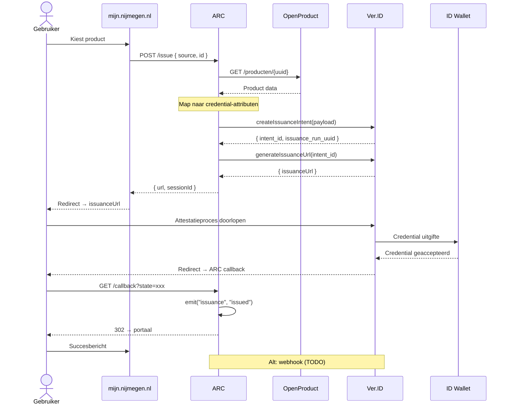

# Attestatie Issuance Flow

## Flow beschrijving

1. Gebruiker kiest een product op **mijn.nijmegen.nl**
2. Portaal roept `POST /issue` aan op **ARC**
3. ARC haalt productdata op bij **OpenProduct** en mapt naar credential-attributen
4. ARC doet `createIssuanceIntent()` naar **Ver.ID** → ontvangt `issuance_run_uuid`
5. ARC doet `generateIssuanceUrl()` naar **Ver.ID** → ontvangt redirect URL
6. Gebruiker wordt geredirect naar de **issuanceUrl** en doorloopt het attestatieproces
7. Ver.ID geeft de credential uit aan de **ID Wallet** van de gebruiker
8. Na afronding redirect Ver.ID de gebruiker terug naar de ARC **callback**
9. ARC verwerkt de callback, emit een `issuance` event, en redirect naar het portaal met succesbericht

**Alternatief:** als de gebruiker de browser sluit na de attestatie, stuurt Ver.ID een **webhook** naar ARC (⚠️ nog niet geïmplementeerd).

## Sequence diagram

